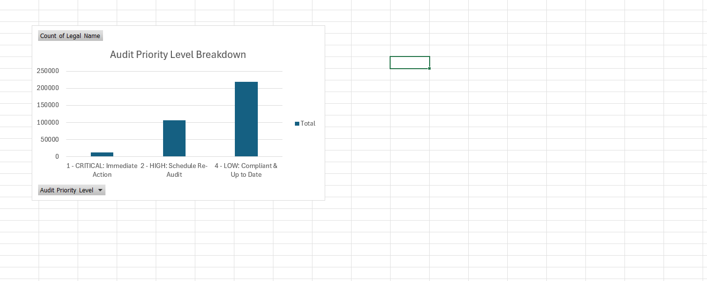

## ⚙️ Phase 1: Data Engineering & Power Query Transformation
To handle the scale of the dataset natively within Excel and prepare it for advanced DAX modeling, several new variables and conditional columns were engineered from the raw data.

### 1. Days Since Last Audit
A mathematical date calculation subtracting the `Inspection End Date` from the current reporting date to establish a concrete, numerical value for facility neglect.

### 2. Compliance StatusCustom
A conditional categorical grouping that evaluates the days neglected and inspection history to assign a strict operational status (e.g., `"Action Required"` or `"Compliant"`).

### 3. Audit Priority Level
A tiered bucket system used as the primary axis for high-level dashboard filtering. The logic segments facilities into actionable cohorts:
*   **1 - CRITICAL:** Immediate Action
*   **2 - HIGH:** Schedule Re-Audit
*   **4 - LOW:** Compliant & Up to Date

## 🧠 Phase 2: DAX Data Modeling (The Engine)
Instead of relying on standard PivotTables—which crash when attempting to render hundreds of thousands of text strings—I built a custom Tabular Data Model using Data Analysis Expressions (DAX) to act as a computational gatekeeper.

### Function 1: The Threshold Model (Imminent Inspection Target)
This measure forces the calculation engine to completely ignore safe facilities, returning a blank value for anything under the 365-day threshold. This saves critical RAM and isolates the exact targets for the severity chart.

    =CALCULATE(
        MAX('Range'[Days Since Last Audit]), 
        FILTER('Range', 'Range'[Days Since Last Audit] >= 365)
    )

### Function 2: Filter Context Override (Risk Concentration %)
This calculation breaks out of localized slicer filters using the `ALL()` function. It calculates the global total of critical facilities, then divides the localized departmental selection by that global number to establish an exact percentage of the total corporate risk footprint.

    =DIVIDE(
        CALCULATE(COUNTROWS('Range'), FILTER('Range', 'Range'[Compliance StatusCustom] = "Action Required")),
        CALCULATE(COUNTROWS('Range'), FILTER(ALL('Range'), 'Range'[Compliance StatusCustom] = "Action Required"))
    )

## 📊 Phase 3: Dashboard Visualizations & Architecture
Below are the final, polished visualizations powered by the DAX data model, optimized for executive review.

### 1. The Executive Summary

**Explanation:** This zero-lag bucket chart is built directly from the `Audit Priority Level` column. It aggregates the data to instantly show leadership the overall volume of facilities residing in Critical, High, and Low-risk states. By bucketing the data instead of plotting individual facilities, the visualization remains lightweight and highly responsive.

### 2. The Severity Matrix

**Explanation:** This cleaned, 2D horizontal bar chart utilizes the `Imminent Inspection Target` DAX measure. The data is deliberately sorted by severity (largest to smallest) to immediately draw executive attention to the specific project areas suffering from the most extreme cases of audit neglect, many of which have hit a cap of 6,500 days.

### 3. The Pareto Analysis

**Explanation:** Powered by the custom `Risk Concentration %` DAX measure, this chart mathematically fractures the overall 100% risk pool. It acts as a Pareto analysis, visually demonstrating exactly which departments hold the lion's share of corporate liability so that intervention resources can be deployed efficiently.

### 4. RAM-Safe Dynamic Drill-Down

**Explanation:** This Tabular PivotTable is engineered to act as an on-demand hit-list. By applying dashboard Slicers *before* dropping the `Legal Name` into the rows, the Excel engine is gated. This prevents memory overloads while allowing stakeholders to extract specific, high-risk facility names instantly during crisis response planning.
